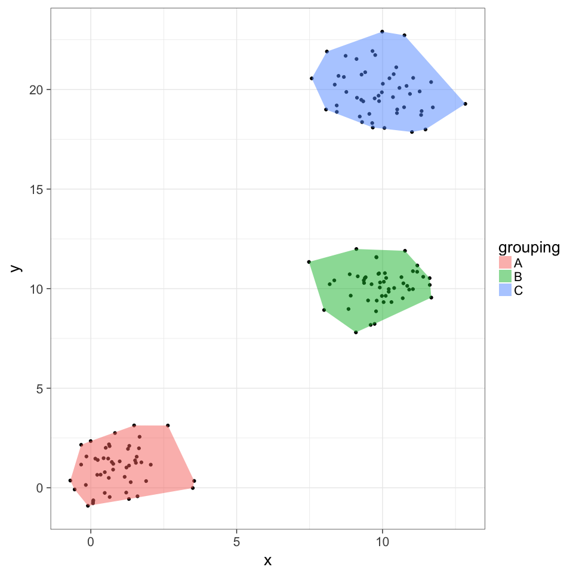

# ggchull example usage
### R function to add convex hulls (i.e. minimum convex polygons) to scatterplot in ggplot2, with optional grouping variable

First, download the file `ggchull.R` from github, then you will use `source()`, which gives you access to the `stat_chull()` function


```r
source("ggchull.R")

require(ggplot2)

example_dataframe <- data.frame(
      x=c(rnorm(50,1),rnorm(50,10), rnorm(50,10)),
      y=c(rnorm(50,1),rnorm(50,10), rnorm(50,20)),
      grouping=rep(c("A","B","C"), each=50)
      )

qplot(x, y, data = example_dataframe) + 
  stat_chull(mapping=aes(fill=grouping), alpha=0.5) + 
  theme_bw(20)
```

<!-- -->
