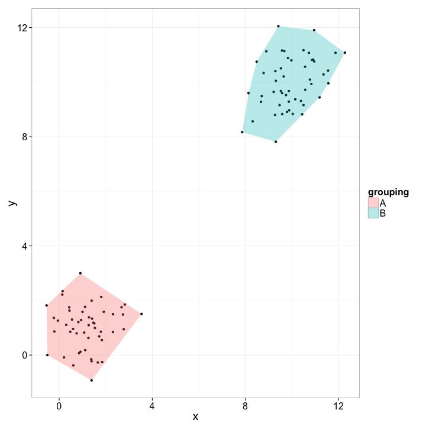

ggchull
========================================================

### R function to add convex hulls to scatterplot in ggplot2, with optional grouping variable


```r
source("ggchull.R")
```

```
## Loading required package: plyr
```

```
## Loading required package: ggplot2
```

```r

require(ggplot2)

test_df <- data.frame(x = c(rnorm(50, 1), rnorm(50, 10)), y = c(rnorm(50, 1), 
    rnorm(50, 10)), grouping = c(rep("A", 50), rep("B", 50)))

qplot(x, y, data = test_df) + ggchull(x = test_df$x, y = test_df$y, grouping = test_df$grouping) + 
    theme_bw(20)
```

 

