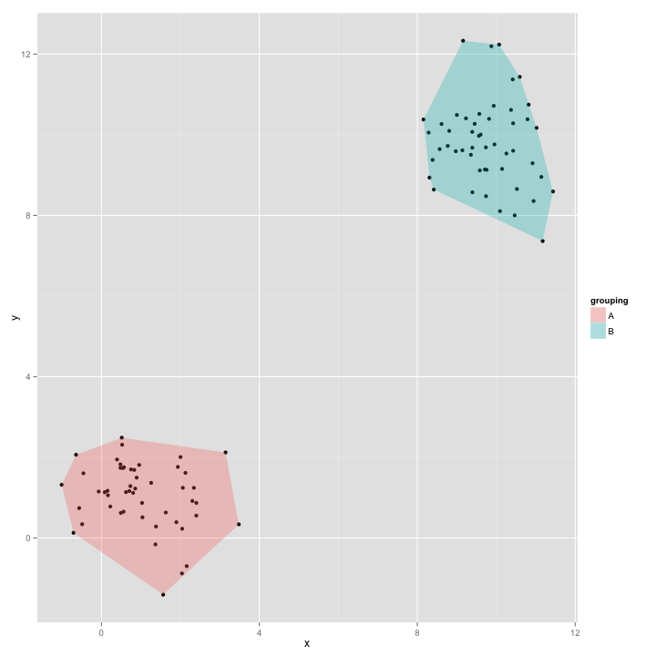

ggchull example
========================================================

```r
source("ggchull.R")
```

```
## Loading required package: plyr
```

```
## Loading required package: ggplot2
```

```
## Warning: package 'ggplot2' was built under R version 2.15.2
```

```r

require(ggplot2)

test_df <- data.frame(x = c(rnorm(50, 1), rnorm(50, 10)), y = c(rnorm(50, 1), 
    rnorm(50, 10)), grouping = c(rep("A", 50), rep("B", 50)))

qplot(x, y, data = test_df) + ggchull(test_df, "x", "y", "grouping")
```

 

